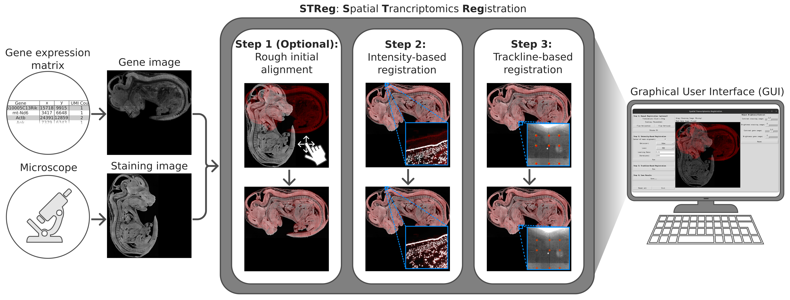
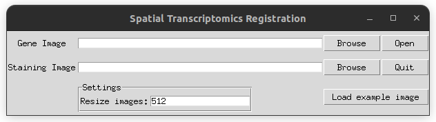
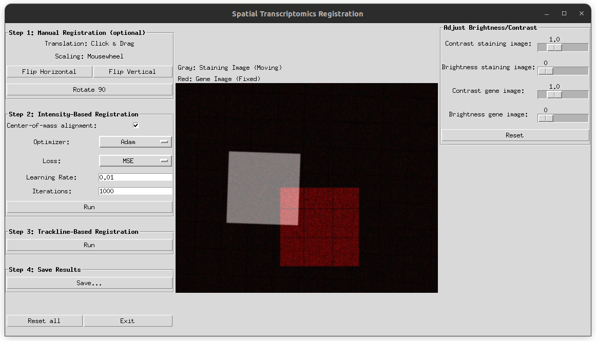

# STReg: Multi-Modal Image Registration for Sequencing-Based Spatial Transcriptomics

Accurate integration of gene expression data and staining microscopy images via spatial alignment is important for analyzing spatial transcriptomics data. We introduce STReg, an image registration method and software to align high-resolution sequencing-based spatial transcriptomics data. This method enables both intensity-based and trackline-based registration, is computationally efficient, and easy to use.


## Install
Ensure that you have Conda installed on your system.
```bash
# 1. Clone the repository 
git clone https://github.com/BMCV/STReg 

# 2. Create a conda environment
conda create --name STReg python=3.14.6

# 3. Activate the newly created conda environment
conda activate STReg 

# 4. Move into the downloaded project directory
cd STReg

# 5. Install dependencies
pip install -r requirements.txt
```

## Data Format Specifications

STReg uses a **gene expression matrix** (.csv) and the corresponding **nuclei staining image** (.tif) as input. The staining image should be a single-channel grayscale image of size (H, W), and the gene expression data should have the following format:

| Gene  | x  | y  | UMI-Count |
|:-------|:--- |:--- |:-----------|
| mt-Nd6|3417|6648| 1         |
| Actb  |24391|12859| 1         |
| Ank  |7379|6343| 2         | 
| ...  |...|...| ... |

## Demo
To verify your installation, a demo dataset is provided in `test_data/`. You can run STReg using the command line or via the Graphical User Interface (GUI).

### Command Line
You can run STReg from the terminal using: 

```bash
python run.py \
    --gene_image test_data/gene_matrix_test.csv.gz \
    --stain_image test_data/staining_image_test.tif \
    --out_dir test_data/results/ \
    --max_size 512 \
    --loss MSE \
    --lr 0.01 \
    --niter 1000 \
    --optimizer Adam \
    --flip_h 0 \
    --flip_v 0 \
    --rot90 0
```

### Graphical User Interface (GUI)
To launch the GUI, run the following command:
```bash
python run_GUI.py
```
The following window will appear, where you can select the paths to the files for the gene expression matrix and the corresponding staining image. Pressing `Load example image` will automatically insert the directories for the test images. 



Once the files are selected, press `Open` to proceed to the main interface shown below.



**Notes:** 
* The brightness and contrast adjustments on the right-hand-side affect only the display and do not change the intensity values of the gene image and the staining image.
* If something does not work, press `Reset all` to restart the registration process.

### Parameters

| Parameter/Action | GUI Control | CLI Flag & Value | Description | 
| :--- | :--- | :--- | :--- |
| Image Size | `Resize images` | `--max_size 512` | Size at which the images are displayed. Accepts integers $\geq 256$ |
| Translation | `Click & Drag Mouse` | - | Shifts the moving image. |
| Scaling     | `Mouse Wheel`         | - |  Scales the moving image. | 
| Flip Horizontal | `Flip Horizontal` | `--flip_h {0\|1}` | Flips the moving image left-to-right. |
| Flip Vertical | `Flip Vertical` | `--flip_v {0\|1}` | Flips the moving image top-to-bottom. |
| 90° Rotation | `Rotate 90` | `--rot90 {0\|1\|2\|3}` | Rotates the moving image by 90° clockwise. |
| Center-of-mass alignment | `Center-of-mass alignment` | - | If no translation or scaling was performed, the center-of-masses of image intensities will be aligned prior to intensity-based registration.|
| Optimization Algorithm | `Optimizer` | `--optimizer {Adam\|SGD}` | Algorithm used for gradient-based optimization. Options: `Adam`, `SGD`. Default: `Adam`.|
| Loss Function | `Loss` | `--loss {MSE\|NCC\|NMI}` | Intensity-based similarity metric to be optimized. Options: `MSE`, `NCC`, `NMI`. Default: `MSE`.|
| Learning Rate | `Learning Rate` | `--lr 0.01` | Controls the step size to find the optimal transformation parameters. Accepts float $> 0$. Default: `0.01`.|
| Iterations | `Iterations` | `--niter 1000` | Number of steps to find the optimal transformation parameters. Accepts integers $\geq 1$. Default `1000`.|

**Tips**:
* For best results, ensure both images have the same orientation by using horizontal and vertical flipping.
* If the intensity-based registration method does not work well, we recommend decreasing the learning rate (e.g., 0.001).

## Output
STReg generates the following files into the specified output directory:
* `gene_image.tif` - The gene image which was created from the gene expression matrix
* `staining_image_registered.tif` - The registered nuclei staining image
* `parameters.npy` - The transformation parameters

If you would like to apply the estimated transformation to other images (e.g., different channel), use `python streg/apply_transformation`. For example:
``` 
python streg/apply_transformation.py \
        --image test_data/staining_image_test.tif \
        --parameters test_data/results/parameters.npy \
        --out test_data/results/staining_image_ch2.tif
```

## Reproducing the Paper
The `scripts/` directory contains bash scripts to reproduce the results in the paper. Download the required datasets from the links below, place them in the specified folders, and run the script.

### Stereo-Seq Mouse Embryo Dataset (Chen et al., 2022)
* **Download Link:** https://db.cngb.org/stomics/mosta/download/
* **Files to download:** 
    * `Bin1 matrix/E16.5_E2S4_GEM_bin1.tsv.gz`
    * `Image of nuclei acid stainin/E16.5_E2S6.tif`
* **Save to:** `datasets/mouse_embryo/`
* **Run:** `bash scripts/mouse_embryo.sh`
    
### Stereo-Seq Axolotl Brain Dataset (Wei et al., 2022) 
* **Download Link:** https://db.cngb.org/stomics/artista/download/
* **Files to download:**
    * `Bin1 file/10DPI_2.gem.gz` and rename the file to `10DPI_2.tsv.gz`
    * `Image of nuclei acid staining/10DPI_2.tif`
* **Save to:** `datasets/axolotl_brain/`
* **Run:** `bash scripts/axolotl_brain.sh`

### Stereo-Seq Mouse Liver Dataset (Zhang et al., 2024)
* **Download Link:** https://github.com/STOmics/STCellbin/
* **Files to download:**
    * `C01344C4.gem.gz` and rename the file to `C01344C4.tsv.gz`
    * `C01344C4_staining_image.tar` which contains the staining image `C01344C4/C01344C4.tif`
* **Save to:** `datasets/mouse_liver/`
* **Run:** `bash scripts/mouse_liver.sh`

## License
This project is licensed under the **MIT License** - see the [LICENSE](LICENSE) file for details.


## References
Chen, A. et al.: Spatiotemporal transcriptomic atlas of mouse organogenesis using DNA nanoball-patterned arrays. Cell 185.10 (2022)

Wei, X., et al.: Single-cell Stereo-seq reveals induced progenitor cells involved in axolotl brain regeneration. Science 377, 9444 (2022)

Zhang, B., et al.: Generating single-cell gene expression profiles for high-resolution spatial transcriptomics based on cell boundary images. GigaByte 2024 (2024)
